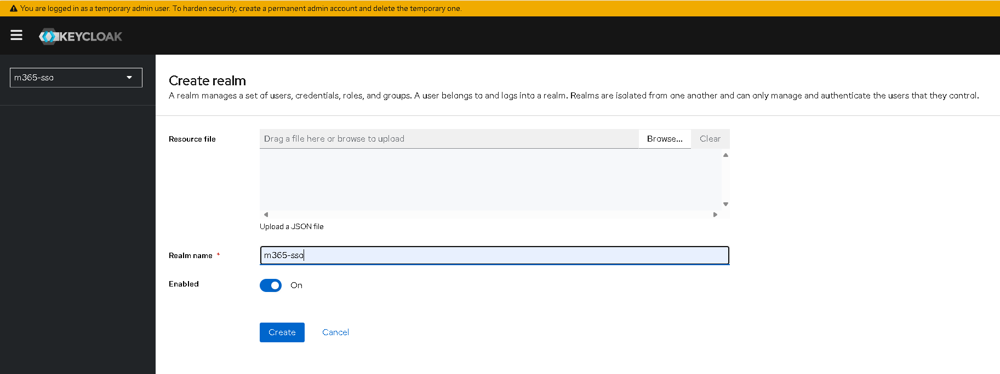
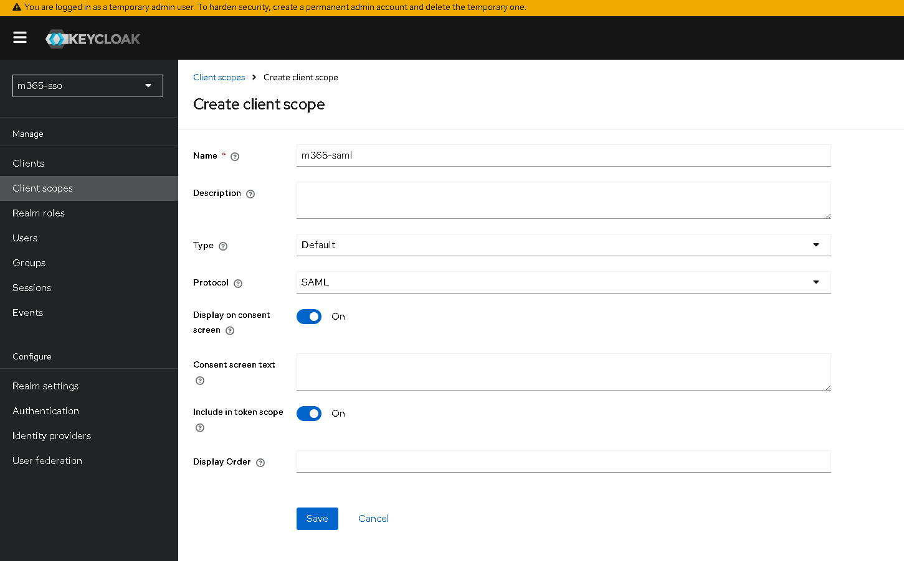
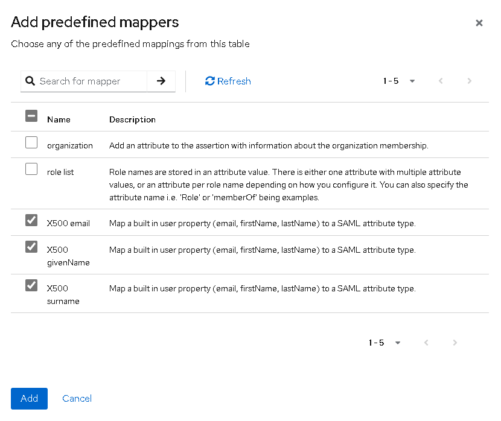
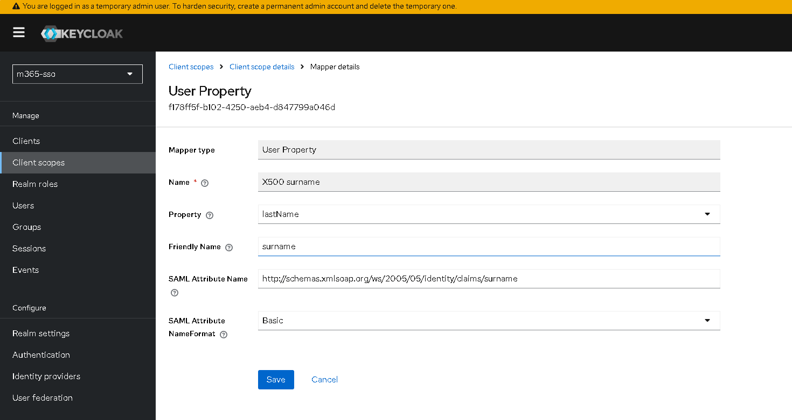
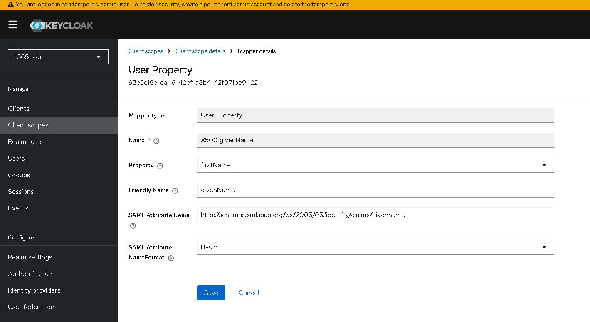
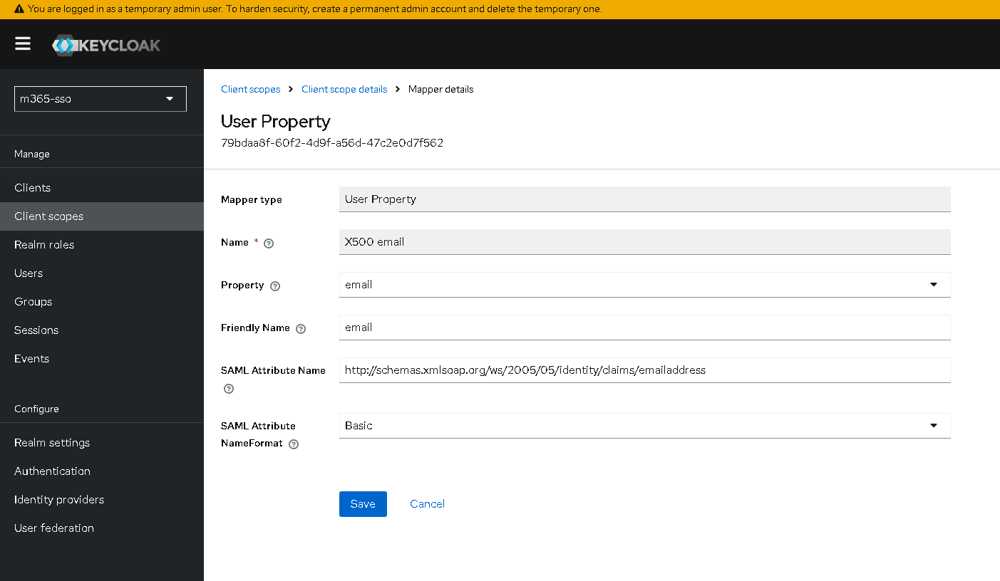

## keycloak の Docker 構築

### .env

.env サンプル

```
KEYCLOAK_ADMIN=admin
KEYCLOAK_ADMIN_PASSWORD='admin'

NGROK_HOSTNAME=https://example.ngrok-free.app
NGROK_HOSTNAME_ADMIN=https://example.ngrok-free.app
```

### docker 環境構築

```
docker-compose up -d
```

### docker 設定やり直したいとき

```
docker-compose down
docker-compose up -d
```

### Docker を全て消し去りたいとき

```
docker-compose down --rmi all --volumes --remove-orphans
```

## keycloak の SAML 設定

M365 に Keycloak で SAML 認証するための設定

### remlm 作成

- Realm 選択で [Create realm] ボタンを押す
- Realm name に m365-sso を入力
- 他の項目はそのまま
  

### ユーザー追加

- 左メニューで、 [Users] をクリック
- [Add user] をクリック
- Username に メアド を入力
- Email に メアド を入力
- First name を入力
- Last name を入力
- [Create] ボタンを押す

### 作成されたユーザーのパスワード設定

- 作成されたユーザーをクリック
- [Credentials] タブをクリック
-

## Client Scopes の SAML 設定

### Client Scopes 作成

- 左メニューの [Client scopes] をクリック
- [Create client scope] ボタンをクリック
- Name に m365-saml と入力
- Type で Default を選択
- Protocol で SAML を選択
- Include in token scope で On に設定
- 他の項目はそのまま
  

### Mappers 設定

- 作成した m365-saml を選択し [Mappers] タブをクリック
- [Add predefined mapper] ボタンを押す
- [X500 email]　[X500 givenName] [X500 surname] をチェックして [Add] ボタンをクリック
  

### 各 X500 設定

#### X500 surname

| key                       | value                                                         |
| ------------------------- | ------------------------------------------------------------- |
| Property                  | lastName                                                      |
| Friendly Name             | surname                                                       |
| SAML Attribute Name       | http://schemas.xmlsoap.org/ws/2005/05/identity/claims/surname |
| SAML Attribute NameFormat | Basic                                                         |



#### X500 givenName

| key                       | value                                                           |
| ------------------------- | --------------------------------------------------------------- |
| Mapper type               | User Property                                                   |
| Name                      | X500 givenName                                                  |
| Property                  | firstName                                                       |
| Friendly Name             | givenName                                                       |
| SAML Attribute Name       | http://schemas.xmlsoap.org/ws/2005/05/identity/claims/givenname |
| SAML Attribute NameFormat | Basic                                                           |



#### X500 email

| key                       | value                                                              |
| ------------------------- | ------------------------------------------------------------------ |
| Mapper type               | User Property                                                      |
| Name                      | X500 email                                                         |
| Property                  | email                                                              |
| Friendly Name             | email                                                              |
| SAML Attribute Name       | http://schemas.xmlsoap.org/ws/2005/05/identity/claims/emailaddress |
| SAML Attribute NameFormat | Basic                                                              |



## Client の Client Scopes 設定

- 左メニュー [Clients] を開く
- [Create client] をクリック
- General settings
  | 設定項目 | 設定値 |
  | ----------- | --------------------------------------- |
  | Client type | SAML |
  | Client ID | m365-saml-client（任意の名称） |
  | Name | Microsoft 365 SAML Client（任意の説明） |
  |Description|(空欄のままで OK)|
  |Always display in UI| OFF (default)|
- Login settings
  | 設定項目 | 設定値 | 説明 |
  | ------------------------------- | --------------------------------------------------- | ---------------------------------------------------------- |
  | Root URL | (空欄のままで OK) | 通常は不要（特定の SP URL を指定する場合のみ） |
  | Home URL | (空欄のままで OK) | 必要に応じて SP の URL（M365 では不要） |
  | Valid Redirect URIs | https://login.microsoftonline.com/{tenant_id}/saml2 | M365 の SAML ACS (Assertion Consumer Service) URL |
  | Valid Post Logout Redirect URIs | https://login.microsoftonline.com/ | M365 のログアウト後のリダイレクト先 |
  | IDP-Initiated SSO URL Name | m365-sso（任意） | Keycloak から IDP-initiated SSO を行う場合の識別名 |
  | IDP Initiated SSO Relay State | (空欄のままで OK) | 特定のアプリケーションへのリダイレクトが必要な場合のみ設定 |
  | Master SAML Processing URL | https://login.microsoftonline.com/{tenant_id}/saml2 | M365 の SAML 処理 URL |
- その他
  | 設定項目 | 変更前 | 変更後 |
  | ----------------------- | -------- | ------------------------------------------------------ |
  | Name ID Format | username | email |
  | Sign Assertions | OFF | ON |
  | SAML Signature Key Name | NONE | KEY_ID |

### Client Scopes の role list, saml_organization を削除

- 左メニュー [Clients] > [Client List] タブ > [m365-saml-client] リンククリック
- [Client Scopes] タブクリック
- role_list, saml_organization 削除

### saml エンドポイントの確認

Realm setting > General > Endpoints > SAML 2.0 Identity Provider Metadata リンクから確認
